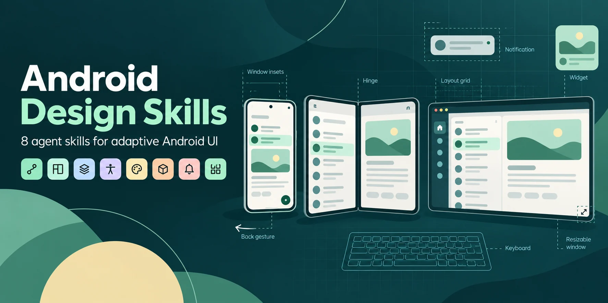

# Android Design Skills

<p align="center"></p>

Eight practical agent skills for designing and reviewing Android UI, grounded in the Android Developers mobile design guides. **Adaptive layout and interaction patterns receive the deepest coverage.**

Use them to turn a screen or journey into concrete decisions about content, panes, navigation, state, input, accessibility, and platform behavior.

## Skills

| Skill | What it handles |
| --- | --- |
| [android-ui-design](skills/android-ui-design/SKILL.md) | Cross-cutting entry point and selective routing |
| [android-ui-layout-content](skills/android-ui-layout-content/SKILL.md) | Composition, adaptive panes, navigation placement, insets, keyboard, foldables, imagery |
| [android-ui-patterns](skills/android-ui-patterns/SKILL.md) | Navigation state, predictive Back, onboarding, passkeys, settings, help and recovery |
| [android-ui-foundations](skills/android-ui-foundations/SKILL.md) | Accessibility, system bars, glossary, platform translation |
| [android-ui-styles](skills/android-ui-styles/SKILL.md) | Color roles, themes, typography, shapes, icons, motion direction |
| [android-ui-components](skills/android-ui-components/SKILL.md) | Component choice, states, semantics and interaction suitability |
| [android-ui-home-screen](skills/android-ui-home-screen/SKILL.md) | Notifications, live updates, picture-in-picture |
| [android-ui-widgets](skills/android-ui-widgets/SKILL.md) | Launcher widget layouts, sizing, style, configuration and discovery |

The bundle contains 8 entry points and 22 focused references. Layout and patterns each have six references, including concrete scenarios and acceptance checks.

## Install

One command installs the bundle for the most common coding agents (requires Node.js):

```sh
npx skills add Sergio-CVM00/android-design-skills -g -a claude-code -a codex -a cursor -a opencode -a pi -y
```

It uses the [`skills`](https://github.com/vercel-labs/skills) CLI to place the eight skills in `~/.agents/skills`, the shared Agent Skills location, and to link them into `~/.claude/skills` and `~/.pi/agent/skills`. Agents that read `~/.agents/skills` pick them up without their own flag.

- Drop `-g` to install into the current project instead (`.agents/skills` and `.claude/skills`).
- Run `npx skills add Sergio-CVM00/android-design-skills` without flags to choose agents and scope interactively, or pass `-a <agent>` for any of the other agents the CLI supports.
- Use `--list` to preview the skills and `--copy` if your environment does not support symlinks.
- Install the whole bundle rather than a single skill with `--skill`: the skills reference each other through relative links.
- Avoid `--all -g`: one of the CLI's agents has no user-level location, so the command exits with an error even though the other installs succeed.

### Supported harnesses

| Harness | Where it finds the skills | Checked |
| --- | --- | --- |
| Claude Code | `~/.claude/skills`, or `.claude/skills` in the project | Install layout |
| Codex | `~/.agents/skills`, or `.agents/skills` in the project | Discovery, user and project |
| OpenCode | `~/.agents/skills`, or `.agents/skills` in the project | Discovery, user and project |
| Pi | `~/.pi/agent/skills` or `~/.agents/skills`, or `.agents/skills` in the project | Discovery, user and project |
| Oh My Pi (`omp`) | `~/.agents/skills`, or `.agents/skills` in the project | Discovery, project |
| Cursor | `.agents/skills` in the project | Install layout |
| DeepSeek Harness (`dsh`) | `~/.agents/skills`, or `.agents/skills` in the project | Documentation |
| Deep Code | `~/.agents/skills` | Documentation |
| DeepSeek-TUI | `.agents/skills` in the project | Documentation |

Pi loads project-local skills only after you trust the project (`pi --approve`, or its trust prompt). User-level installs do not need this.

"Discovery" means the agent listed all eight skills in a fresh session after a clean install. "Install layout" means the skills landed where the agent documents it reads them, but no session was run. "Documentation" means the location comes from the harness's own documentation and has not been run here. None of these checks covers agent behavior with the skills.

### Manual install

Clone this repository:

```sh
git clone https://github.com/Sergio-CVM00/android-design-skills.git
```

Copy the eight directories under `skills/` into your agent's skill directory, for example `~/.agents/skills`. Inspect any existing same-named skills before replacing them.

Keep the directories as siblings so relative cross-skill references work. The `agents/openai.yaml` files provide Codex UI metadata; the Markdown guidance does not require a particular agent harness, browser, model, or paid service. Any other harness that supports the `SKILL.md` convention can load the skills from its own discovery location.

## Example requests

> Use $android-ui-layout-content to adapt this list/detail editor from a phone to a foldable and a resizable window. Preserve the selected item and unfinished edits. Explain the keyboard and hinge behavior.

> Use $android-ui-patterns to review onboarding, permission timing, and Back behavior. Include cancellation, recovery, and returning-user paths.

> Use $android-ui-design to review this Android screen. Keep the existing brand and focus on the parts that need changes.

For a focused task, invoke a specialist directly. The main skill routes broader work without loading every reference.

## Coverage and limits

The [source map](docs/source-coverage.md) maps all **33 sidebar entries** in the seven mobile Guides groups reviewed on **2026-10-04**. One entry is the home-screen widgets overview alias. The [machine-readable inventory](docs/coverage.json) supports maintenance.

This is a practical synthesis, not an official Google product or a mirror of the documentation. It does not claim exhaustive coverage of every linked Material specification, Figma resource, developer API guide, Wear OS, TV, Auto, or XR.

Source recommendations are distinguished from authored recipes. Platform and library behavior can change. Check the current linked implementation guidance and the target project's versions before coding; these skills do not require an automatic dependency upgrade.

## Validation

Run the dependency-free repository checks with Python 3.10 or newer:

```sh
python3 scripts/validate.py
python3 scripts/validate.py --online
```

The default check validates the bundle's constrained frontmatter/metadata format, local links, reference reachability, and coverage mappings. The optional online check also checks Android source availability and compares the live sidebar inventory.

These checks do not prove that an agent will make good decisions or that a real app passes Android accessibility, device, credential-provider, notification, or widget-host tests. Use the authored [interaction scenarios](skills/android-ui-patterns/references/scenarios-and-validation.md) and [layout matrix](skills/android-ui-layout-content/references/recipes-and-validation.md) for behavioral evaluation.

See [validation scope](docs/validation.md) for the initial release evidence and limits.

## License and attribution

[Apache License 2.0](LICENSE). See [NOTICE](NOTICE) for Android Developers / Android Open Source Project attribution, source licensing, and the distinction between upstream guidance and this repository's adaptations. No upstream screenshots, videos, logos, or Figma assets are bundled.
